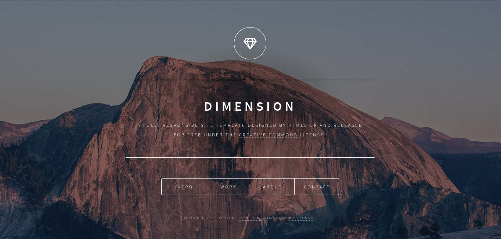
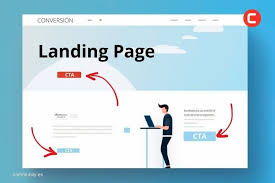
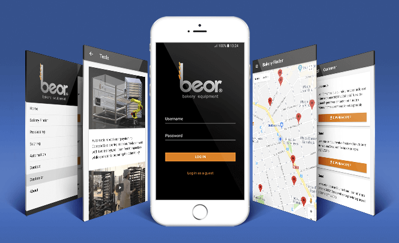

# Practica-Git
# PROYECTO GRUPAL 
# PLANTILLA WEB MULTIFUNCIONAL

## 🌟 ¿Qué es la plantilla "Dimension"?
La plantilla "Dimension" es una plantilla web de HTML5 UP, diseñada con un estilo moderno, limpio y minimalista. Se trata de una página de una sola sección (one-page), lo que la convierte en una opción ideal para proyectos que buscan destacar un mensaje claro y directo. Su estructura visual permite una gran flexibilidad, permitiendo que el contenido se vea atractivo y fluido en dispositivos móviles y escritorios.

Con un diseño centrado en la imagen de fondo y la tipografía estilizada, "Dimension" es perfecta para destacar proyectos personales, productos o servicios con un enfoque minimalista, pero impactante.

## EJEMPLOS DE USO PARA LA PLANTILLA
* **Portafolio personal de un profesional**, Ideal para mostrar tus habilidades y trabajos previos, tales como:

🔹Diseño gráfico

🔹Desarrollo web

🔹Fotografía

🔹Freelancers en general.

* **Landing page para productos o servicios**, Si estás lanzando un producto o servicio, esta plantilla es perfecta para crear una página simple y atractiva con:

🔹Descripción breve

🔹Características clave

🔹Llamados a la acción (comprar, suscribirse, obtener más información)

* **Presentación de una app o software**, Perfecta para una página de aterrizaje de una nueva aplicación o software, destacando:

🔹Características principales

🔹Imágenes o capturas de pantalla

🔹Enlaces de descarga (App Store, Google Play)

🔹Testimonios de usuarios o casos de éxito

* **Página de productos o servicios técnicos** esta plantilla puede presentar tus servicios con claridad, mostrando:

🔹Reparación de computadoras y celulares

🔹Desarrollo web y aplicaciones móviles

🔹Servicios de mantenimiento preventivo y consultoría tecnológica

